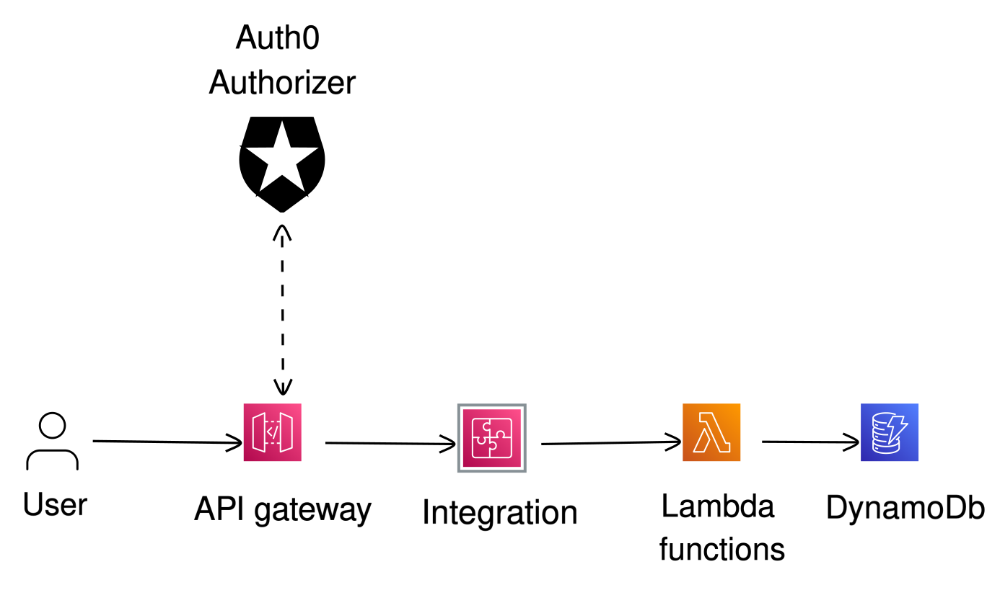

# AWS HTTP API, with Lambda, DynamoDB and Auth0, deployed by Pulumi

This example deploys an HTTP API on AWS using Lambda, DynamoDB and Auth0. The API is a simple CRUD API for resousrces (TODO items in this case) and is secured using Auth0 as an external IAM provider.

The biggest advantage of this example, that it can be deployed with a single command, without any manual steps. The Auth0 configuration is done by the Pulumi program, so you don't have to do it manually.

Also, this app can be scaled to handle any amount of traffic, as it uses DynamoDB and Lambda, which are both highly scalable, and the scale process doesn't require any manual steps either.

## Prerequisites

- [Install Pulumi](https://www.pulumi.com/docs/get-started/install/)
- [Configure AWS Credentials](https://www.pulumi.com/docs/intro/cloud-providers/aws/setup/)
- [Create an Auth0 API](https://auth0.com/docs/get-started/dashboard/tenant-settings#create-an-api)
- Set secrets for Auth0:
  ```console
  pulumi config set --secret audience <audience>
  pulumi config set --secret issuer <issuer>
  ```
- Deploy the stack:
  ```console
  pulumi up
  ```

That's it! Pulumi will create all the neccessary resources on AWS, including Authorizers, API Gateway, DynamoDB tables, Lambda functions and integrations, and IAM roles.

## Testing

After the stack is deployed, you can test the API with the following commands:

- Create a TODO item:

  ```console
  curl --location $(pulumi stack output endpoint)/task \
  --header 'Content-Type: application/json' \
  --header 'Authorization: Bearer \<JWT-TOKEN\>' \
  --data '{
    "title": "Test Task",
    "description": "Some description text",
    "completed": false
    } '
  ```

  - JWT token for the test can be obtained from the Auth0 dashboard, under the "Test" tab of the API.

## Diagram:



## Cleanup

To clean up resources, run `pulumi destroy` and answer the confirmation question at the prompt.
